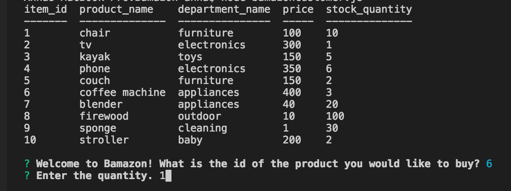
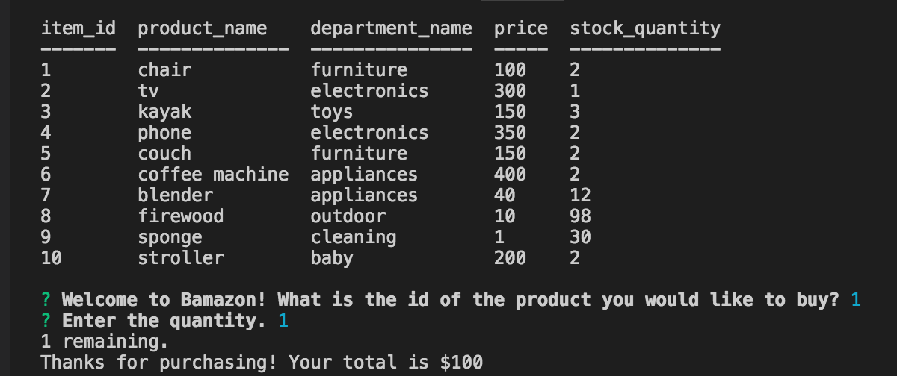
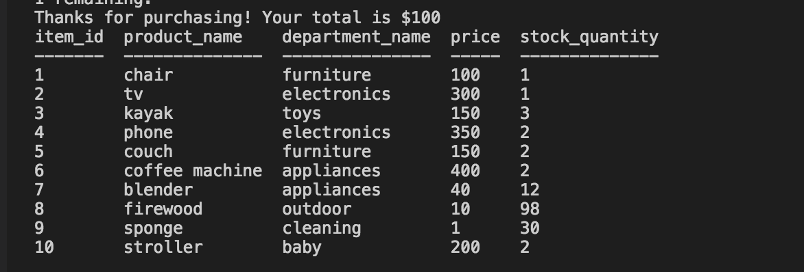
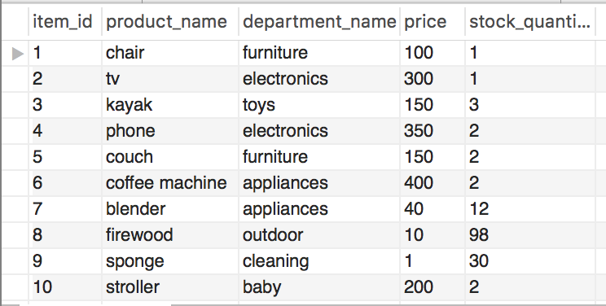

# Node.js & MySQL
## Overview
A CLI Amazon-like storefront app with the MySQL. The app will take in orders from customers and deplete stock from the store's inventory. 

Bamazon App! The app will prompt users with two messages.
The first should ask them the ID of the product they would like to buy.
The second message should ask how many units of the product they would like to buy.

The customer is able to place an order and select any quantity. However, if the quantity exceeds the current stock levels at the warehouse database then an error will occur and disable to customer from exceeding too large of an order.

The app will alert 'Insufficient quantity!' and will ask the user again what they would like to purchase.

If the customer places an order successfully, the app will Thank them for their purchase, provide the total for the purchase, and how many are remaining in the warehouse database.

The app will then update the SQL workbench database and reflect the remaining quantity in the app.

mySQL workbench database will updates from the app.

